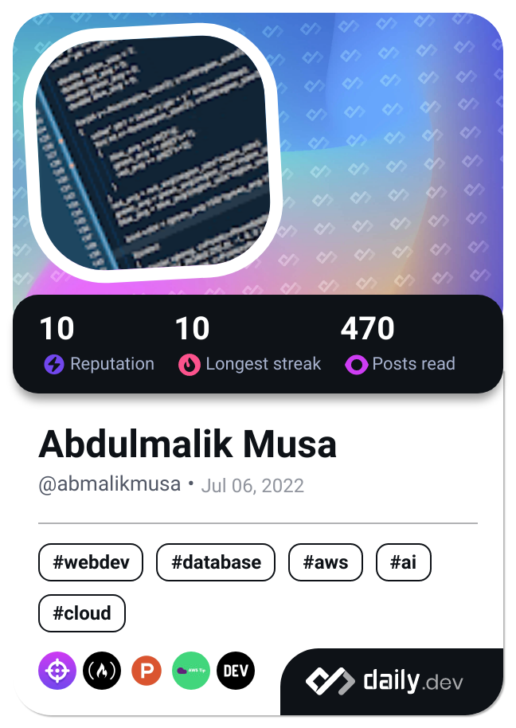

### 👋 Hello World! 👋

<!--
**abmalikmusa/abmalikmusa** is a ✨ _special_ ✨ repository because its `README.md` (this file) appears on your GitHub profile.

Here are some ideas to get you started:

- 🔭 I’m currently working on ...
- 🌱 I’m currently learning ...
- 👯 I’m looking to collaborate on ...
- 🤔 I’m looking for help with ...
- 💬 Ask me about ...
- 📫 How to reach me: ...
- 😄 Pronouns: ...
- ⚡ Fun fact: ...
-->
<!---->

# 👋 Hi, I'm Abdulmalik Musa

- 💻 Software Development Lead | Product Strategist | Tech Optimiser
<!--- 🔧 Tools I use: `.NET Core`, `SQL Server`, `Next.js`, `SharePoint`, `Power BI`, `NGINX`, `Linux`-->
- 🛠️ I build solutions, streamline ops, and solve real-world business problems with clean, scalable code.
- 📫 Let’s collaborate on open-source, mentorship, or smart product ideas.

> “Code with purpose. Lead with empathy. Simplify everything.”

