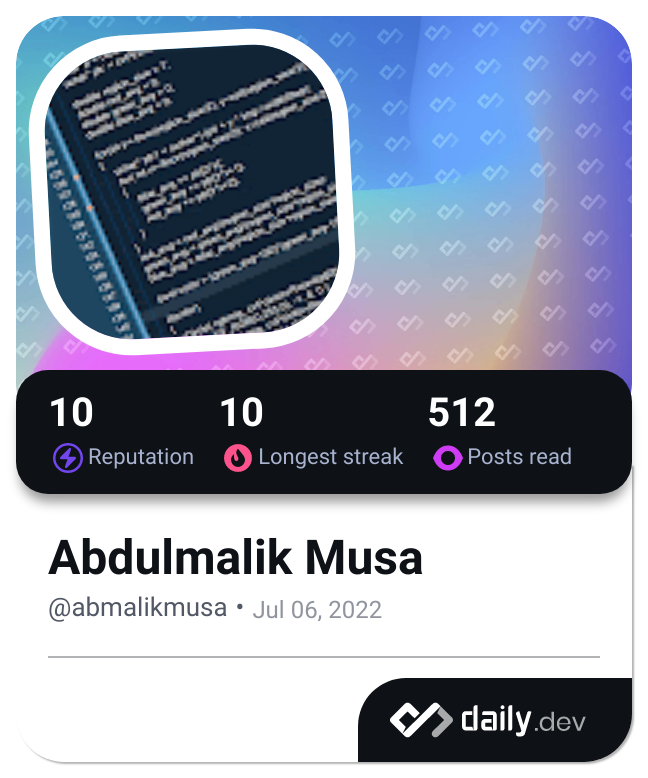

<!--### 👋 Hi there, I'm Abdulmalik Musa 👋
### 💼 Software Development Lead | Product Strategist | Tech Builder-->

# 👋 Hi there, I'm Abdulmalik Musa

### 💼 Software Development Lead | Product Strategist | Tech Builder

Welcome to my GitHub! I'm a passionate and solutions-focused software development leader with hands-on experience in designing scalable systems, architecting solutions, and driving digital transformation across enterprise environments.

I currently lead Technology teams where I help design, build, and maintain robust, secure, and efficient applications that support both internal operations and customer-facing services.

---

### 🧠 What I Do

- 🔹 Architect and implement scalable RESTful APIs 
- 🔹 Build and manage relational databases, optimise performance and automate processes
- 🔹 Design secure workflows
- 🔹 Drive product strategy and roadmap execution for internal and client-facing tools
- 🔹 Mentor developers and contribute to a culture of clean code, collaboration, and innovation

---

### 🧰 Tech Stack

- **Languages & Frameworks:** C#, .NET Core, JavaScript, TypeScript, Next.js  
- **Dev Tools & Platforms:** Git, GitLab, Azure DevOps, Visual Studio, Postman  
- **Cloud & Deployment:** NGINX, Linux, IIS, Docker, Kubernetes  
- **Data & BI:** PostgreSQL, MongoDB, SQL Server, Power BI, Google BigQuery
- **Security & Identity:** Microsoft Entra ID, JWT Auth  

---

### 💬 Let’s Connect

I'm always open to:
- Collaborating on open-source projects
- Sharing knowledge with upcoming developers
- Discussing system design, product leadership, or clean code
- Exploring impactful tech ideas

📫 **Reach me via:**  
- LinkedIn: [https://www.linkedin.com/in/musaabdulmalik/](#)  

---

<!--
**abmalikmusa/abmalikmusa** is a ✨ _special_ ✨ repository because its `README.md` (this file) appears on your GitHub profile.

Here are some ideas to get you started:

- 🔭 I’m currently working on ...
- 🌱 I’m currently learning ...
- 👯 I’m looking to collaborate on ...
- 🤔 I’m looking for help with ...
- 💬 Ask me about ...
- 📫 How to reach me: ...
- 😄 Pronouns: ...
- ⚡ Fun fact: ...
-->
<!---->

---
> “Code with purpose. Lead with empathy. Simplify everything.” 

